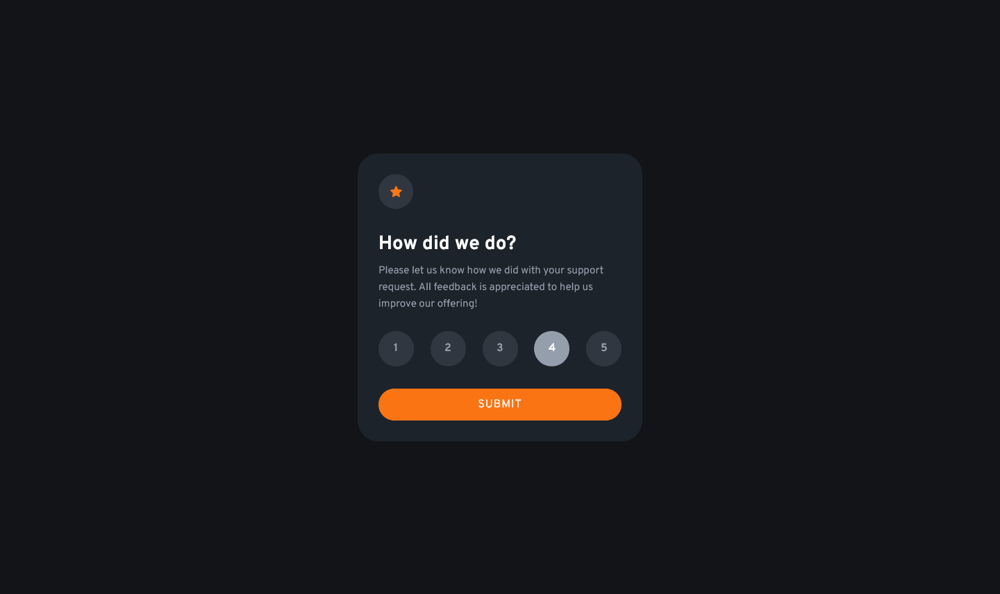
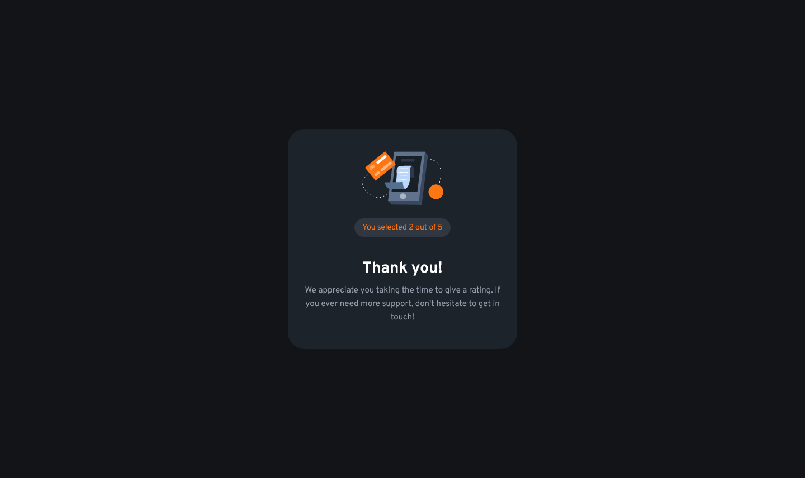

# Frontend Mentor - Advice generator app solution

This is a solution to the [Interactive rating component challenge on Frontend Mentor](https://www.frontendmentor.io/challenges/interactive-rating-component-koxpeBUmI). Frontend Mentor challenges help you improve your coding skills by building realistic projects. 

## Table of contents

- [Overview](#overview)
  - [The challenge](#the-challenge)
  - [Screenshot](#screenshot)
- [My process](#my-process)
  - [Built with](#built-with)
- [Author](#author)

## Overview

### The challenge

Users should be able to:

- View the optimal layout for the app depending on their device's screen size
- See hover states for all interactive elements on the page
- Select and submit a number rating
- See the "Thank you" card state after submitting a rating

### Links

- Solution URL: [GitHub](https://github.com/sergii-moroz/Interactive-rating-component)

## My process

YouTube
- [part 1](https://youtu.be/zkmw0xgFpfg)
- [part 2](https://youtu.be/L9HElpQ82KA)

### Built with

- HTML5
- SASS
- JS

## Author

- Frontend Mentor - [link](https://www.frontendmentor.io/profile/sergii-moroz)

### Screenshot

